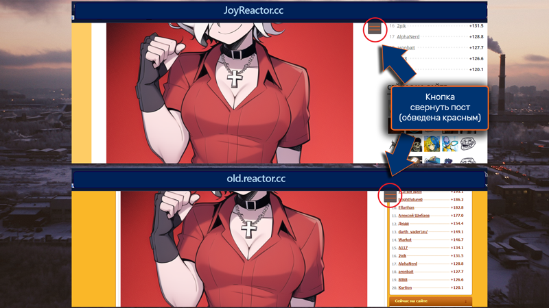

# JoyReactor Improved - Post Minimizer - Chrome
Предназначенно для сайта Joyreactor.cc, old.reactor.cc.
Расширение для браузера Chrome и/или других на базе Chromium.

## Описание
При открытии длинного поста, добавляет рядом с телом поста кнопку, нажатие на которую свернет пост в компактное состояние.
При прокрутке поста до его конца, кнопка автоматически исчезнет. В настройках расширения есть опция для выбора позиции кнопки - слева или справа от поста.

## Установка
Расширение можно установить двумя способами - из магазина расширений или вручную, из файла.

#### Chrome Web Store 
[В магазин](https://chrome.google.com)

#### Из файла
- Скачать исходный код (зеленая кнопка Code -> Download Zip).
- Распакуйте скачанный архив.
- В браузере перейдите в раздел настроек расширений.
- Включите режим разработчика.
- Выберите "загрузить распакованное расширение".
- Выберите распакованную из архива папку "extension-chrome".
- Подтвердите выбор.

## Лицензия
[MIT](LICENSE)
